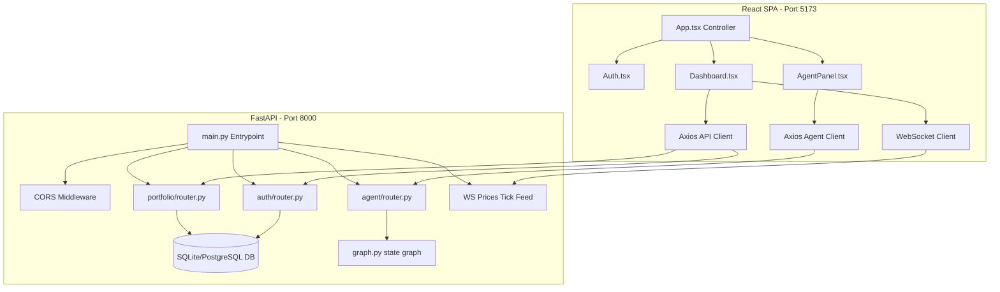
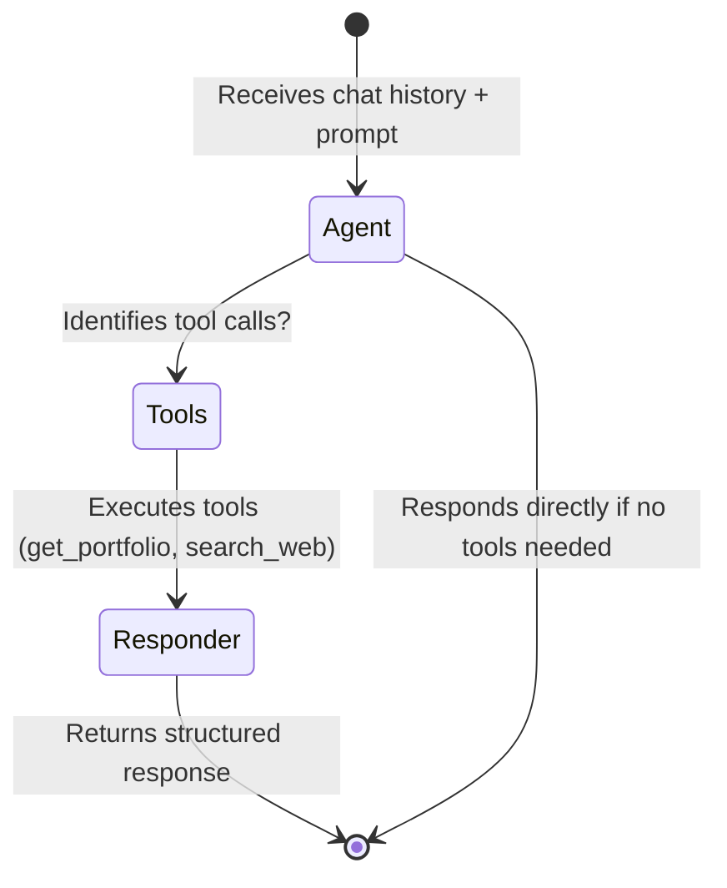

# Flow Investment Platform Architecture 🏗️

This document details the engineering design, data flows, and architectural principles adopted in the Flow Investment platform.

---

## 🏛️ Architectural Structure: Modular Monolith

The application is structured as a **Modular Monolith**, clearly separating backend responsibilities (API, Agent) and frontend code (Vite React). This allows for agile development, simplified deployment, and clean separation of concerns.

---

## 💾 Core Data Flows

### 1. Authentication & Security (JWT)
1. The user submits credentials on the frontend login screen (`Auth.tsx`).
2. The `/auth/login` endpoint validates the password using `bcrypt` in the relational database (SQLite/PostgreSQL).
3. If valid, the backend signs and returns a secure JWT token.
4. The client stores the token in `localStorage` and includes it in the `Authorization: Bearer <token>` HTTP header using Axios request interceptors.

### 2. Real-Time Investment Tracking
1. The `Dashboard.tsx` component opens a WebSocket connection to `/portfolio/prices/ws`.
2. Every 2 seconds, the backend simulates fluctuations in active stock/ETF prices (`prices.py`) by up to +/-0.2% and pushes the JSON updates.
3. The frontend updates the assets table and consolidated balance instantly without making redundant database queries.

### 3. Flow Agent & LangGraph
The financial assistant side panel execution is orchestrated using **LangGraph**:

* **Context Injection:** The `/agent/chat` request passes JWT authentication. FastAPI validates the user and injects the `user_id` into the LangGraph state execution context (`RunnableConfig`).
* **`get_portfolio` Tool:** Reads the `user_id` from the context config, queries holdings from the database, combines them with the latest simulated market prices, and returns a detailed consolidated textual report to the agent.
* **Resilience & Fallback Mode:** If the LLM api keys are missing, the graph gracefully routes requests to a local regex-based rule engine that calls the same database tools and formats matching responses, allowing functional offline testing.

---

## 🎨 Design System & UX

The premium UI utilizes a **Glassmorphic Dark** approach:
* **Base Palette:** Deep dark slate background (`#080b11`) paired with translucent glass cards (`rgba(18, 24, 38, 0.6)`) utilizing background blur filters (`backdrop-filter: blur(16px)`).
* **Focus Glows:** Glow effects and borders with cyan/purple gradients highlighting interactive actions.
* **Micro-animations:** Smooth 0.3s transitions on all hover states and entry cards (`@keyframes fadeIn`).
